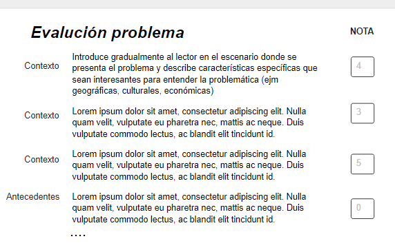
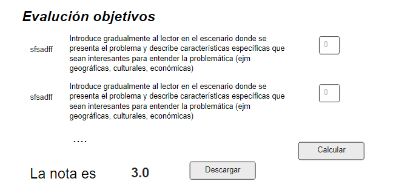

# Ejemplo de proyecto

Evaluador de entregas parciales - anteproyecto

Información introductoria disponible en: [Esta presentación](https://docs.google.com/presentation/d/1YZ56m2BQTawpqtSPkPywT94yGARn5N7J/edit?usp=sharing&ouid=112367552149011376006&rtpof=true&sd=true)

Diagramas disponibles en draw.io en este [link](https://drive.google.com/file/d/15jLY0d9PIlFykmX-SicIs_8e5i72VUsF/view?usp=sharing): 
## Configuracion

### Instalación del archivo requirements.txt

* Ejecutar el siguiente comando en consola ubicado en la carpeta raiz del proyecto

> ``pip install -r requirements.txt``

* Espere a que descarguen las dependencias. Esto puede tomar un tiempo. Si encuentra algún error revise la consola,
  busque en internet y corrija
* Corra su programa dando click derecho en el archivo run.py > "Run run.py"
* Si necesita correrlo en debug seleccione el mismo archivo pero corralo en modo debug
  > ``run.py > "Debug run"``

## Actividades

1. Ejecute el proyecto. Abra el navegador y verifique que puede navegar entre todas las pestañas
2. Personalice el mensaje que sale en la opción "About"
3. Explorar los controles de streamlit.
    1. Agregue al menos dos controles de tipo "input widgets" en el archivo PruebaPartial
    2. Intente organizar el contenido en dos columna
    3. Pruebe el contenedor expander. Ponga texto dentro de este contenedor
4. Funcionamiento de controles en la clase `MainView`
    1. En qué parte de ese archivo se dibuja la barra lateral.
    2. Observe el método `controlar_menu` del archivo MainView. ¿Para qué sirve la variable `self.menu_actual`?
    3. Intente agregar una nueva opción a la barra lateral y pruebe que funciona
5. Control de estado en la app
    1. Investigué qué es una sesión en una Aplicación web
    2. Investigue cómo streamlit controla el manejo de la sesión
    3. En el código de ejemplo, en qué parte se hace manejo de estado
       1. Extender
          1. Agregue al menos otros dos campos en EvalPartial relacionados con la información que contiene EvalAnteproyecto
          2. Mejore la presentación de los elementos listados cuando se da click en la opción "ListarEvaluaciones"
          3. Mejore la interfaz gráfica en la opción de ``agregar_evaluacion`` de manera que pregunte por los siguientes campos  
          definidos en el model en la clase ``EvalAnteproy``: 
            >self.observaciones 
             self.fecha_evaluacion 
             self.nombre_estudiante 
             self.id_estudiante 
             self.tema_proyecto 
             self.version_doc
       
       2.Evaluar anteproyecto: ajustar la interfaz gráfica para lograr algo similar
        a lo que muestran las siguientes imágenes 1
           
           